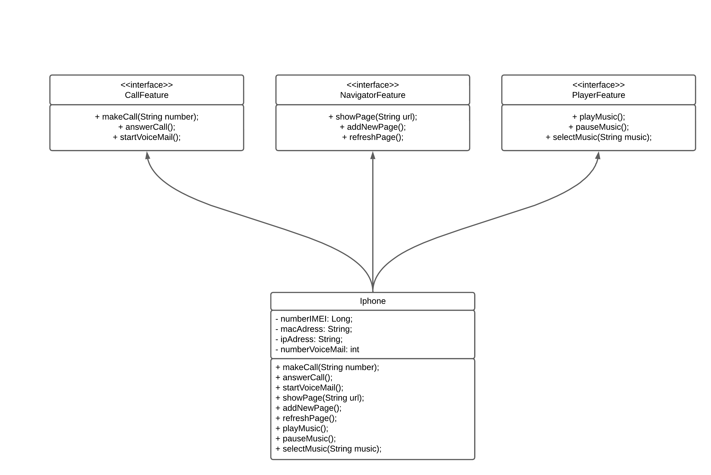

### Orientação a Objetos e UML: Diagrama de Classes do iPhone

Este projeto tem como objetivo apresentar a modelagem das funcionalidades unificadas em um único dispositivo revolucionário: o iPhone.

Com seu lançamento, o iPhone consolidou funcionalidades de diversos dispositivos populares da época, incluindo:  
- **Aparelho Telefônico**
- **Navegador Web**
- **Player de Música**

Além disso, o projeto inclui:  
1. Um diagrama UML ilustrando a estrutura básica dessa abstração.  
2. A implementação inicial do diagrama em **Java**.

Esse trabalho foi desenvolvido no contexto da disciplina *"Modelando o iPhone com UML: Funções de Músicas, Chamadas e Internet"*, parte do bootcamp *"Coding the Future - Java e SpringBoot | Claro - Java com Spring Boot"*, ministrado pelo professor Gleyson Sampaio na plataforma DIO.
